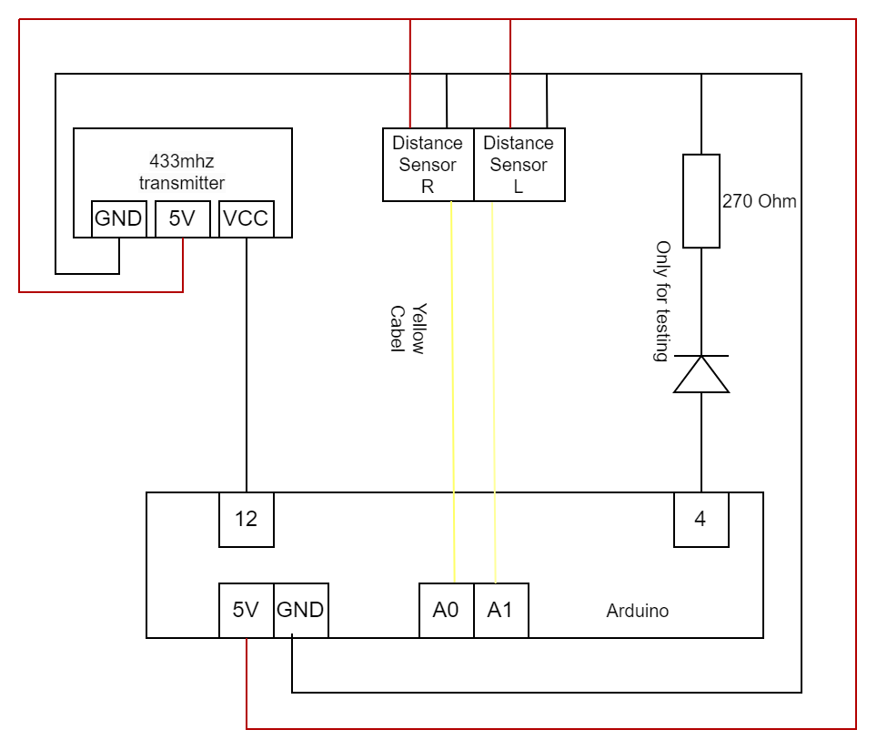

# 433MHz-light-controller
Turns on and off the light in a wardrobe if a door is open with help off a 433MHz sender and two IR-sensors too see if a door is open.
Hope my parents like that the light turns on automatic instead of using a stupid remote controller for turning the light on and off.

## Libary used:  
Used to control the 433MHz sender and receiver [rc-switch](https://www.arduino.cc/reference/en/libraries/rc-switch/)  

## IR-sensors used:  
Sharp GP2Y0A21 IR Distance Sensor (10-80cm)  
[Sensor](https://www.aliexpress.com/item/32440560378.html?spm=a2g0s.9042311.0.0.1af74c4duRqzf8)  

## 433MHz sender:  
Used the receiver for decoding the info from the remote controller.  
Used the sender for toogle the light.  
[433 sender and receiver ](https://www.aliexpress.com/item/32763193655.html?spm=a2g0s.9042311.0.0.1af74c4duRqzf8)

## Help stuff:  
[Help for Decode and Send 433 MHz](https://randomnerdtutorials.com/decode-and-send-433-mhz-rf-signals-with-arduino/)  
[The 433 receiver in the wardrobe](https://www.halemeier.de/fileadmin/templates/Product/Data/1994801_MA_TriMitter.pdf)

## Schematic:
